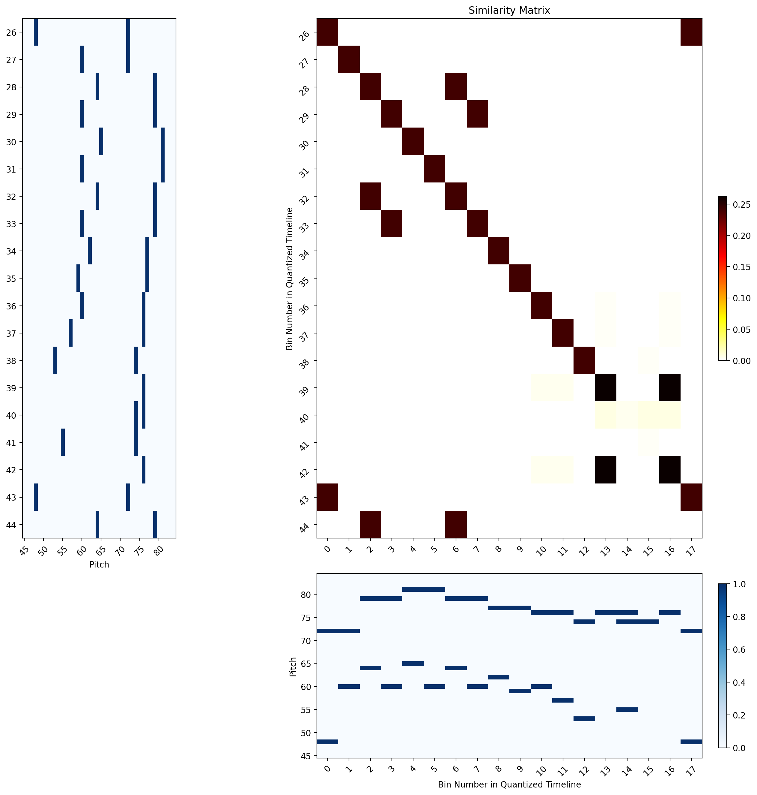

### Annotation File 1
- **Filename**: 02_2024-08-02_Mozart_Var_constructed_annot.mid
- **Download**: [MIDI](./annotated_files/02_2024-08-02_Mozart_Var/02_2024-08-02_Mozart_Var_constructed_annot.mid)
- **Groups**: 2
- **Description**:
This example is the shortest and most straightforward from the annotated set. It is constructed from a rehearsal of Mozart’s Twelve
Variations on "Ah vous dirai-je, Maman"

#### Visual Overview

| Group 1                                                                                     | Group 2                                                                                     |
|---------------------------------------------------------------------------------------------|---------------------------------------------------------------------------------------------|
|                                       |                                       |

#### Info/Challenges per group
- There are no note order variations between intervals of group 1.
- Between instances of group 2, there are note variations due to the execution of a trille towards the end of the fragment. The trille exists in the 2nd and 4th fragment instance. However, for this annotation example we keep the intervals part of the same group because the goal to understand their effect of such type of note variations.

A closer look at the similarity matrixes between intervals of a group can demonstrate the above traits.

*The tick indexes reflect the bin numbers within the SSM of the whole rehearsal.*

|  |  |
|:-----------------------------------------------------------------------------:|:-----------------------------------------------------------------------------:|
| *Group 1 Example: the consecutive bins maintain almost identical pitch information with the exception of a short break that does not result in an offset of the diagonal's continuation.* | *Group 2 Example: Fragment on the y-axis is executed with a trille. So, in addition to low similarity regions, the diagonal is offset by the number of extra notes.* |

### Walkthrough of the Rehearsal Structure Analysis Pipeline

#### Diagonal Finding:

The light blue lines indicate the diagonals found using:
- minimum length = 10
- gap tolerance = 5
- similarity threshold = 0.2

The green lines represent group2 intervals, which we show to demonstrate the aforementioned challenges of this group specifically and how it affects the results. The intersections of the green lines is where we would (ideally) want to find a diagonal.

- For group 0:
3 long diags with enough coverage 
however, another diagonal subset is included which will likely lead to an irrelevant grouping, (the 3 short diagonals at the bottom). 
It could be avoided by increasing the minimum length parameter, or for it to be later discarded later based on improved filtering approaches. 

- As for group 1, there are 5 diagonals we would have wanted to find, only 2 of which actually have diagonals. The trille example
The example with the trille will be impossible to get a proper diagonal for. Not only is the number of events different, which makes the diagonal non exact even if the endings would be the same. and the notes are different (it is not repetition of the same note) [this is mozart var group 2 - 1 and 2

### Resulting Intervals

The parameter values used for the provided results file are as follows:

minimum length = 10
gap tolerance = 5
similarity threshold = 0.2
interval_overlap_ratio = 0.85

The group's output is provided as a separate midi file, with the group number as its name. The intervals of each group are provided as a midi note 24, with the span of the note indicating the duration of the interval.

[Download](./annotated_files/02_2024-08-02_Mozart_Var/results/10_0-2_5.zip)

To view the results:
- Load the annotated file in a DAW.
- load the desired group/s as separate tracks.

