### Annotation File 2
- **Filename**: 2024-08-27_18-16_03_ponce_20Can-part2_annot.mid
- **Download**: [MIDI](./annotated_files/2024-08-27_18-16_03_ponce_20Can/2024-08-27_18-16_03_ponce_20Can-part2_annot.mid)
- **Groups**: 6
- **Description**: A longer example of an intermediate level repertoire with some overlaps between groups. There are several note mistakes and note repetitions (within windows of 1-5 notes until recovery from the mistake), the most challenging aspect are compositional variations between intervals of the same group, where the rh is the same but the lh is different. Furthermore, some groups have 2 related intervals only. 

#### Visual Overview

<table>
  <tr>
    <td align="center" width="50%">
      <a href="">
        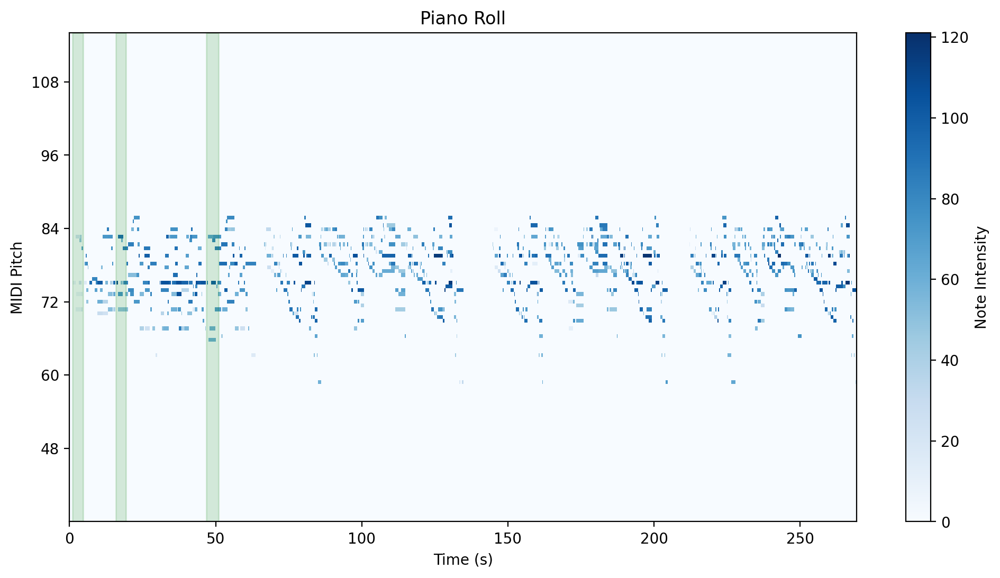
      </a>
       
      <em></em>
    </td>
    <td align="center" width="50%">
      <a href="">
        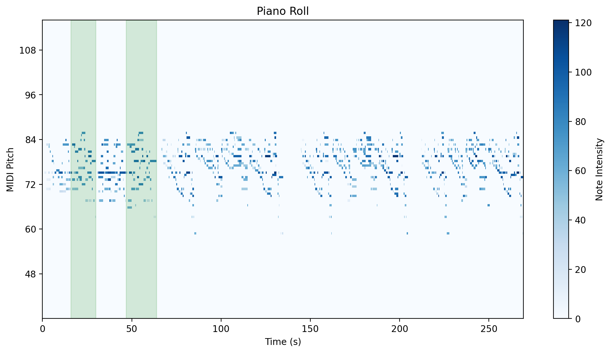
      </a>
       
      <em></em>
    </td>
  </tr>
  <tr>
    <td align="center" width="50%">
      <a href="">
        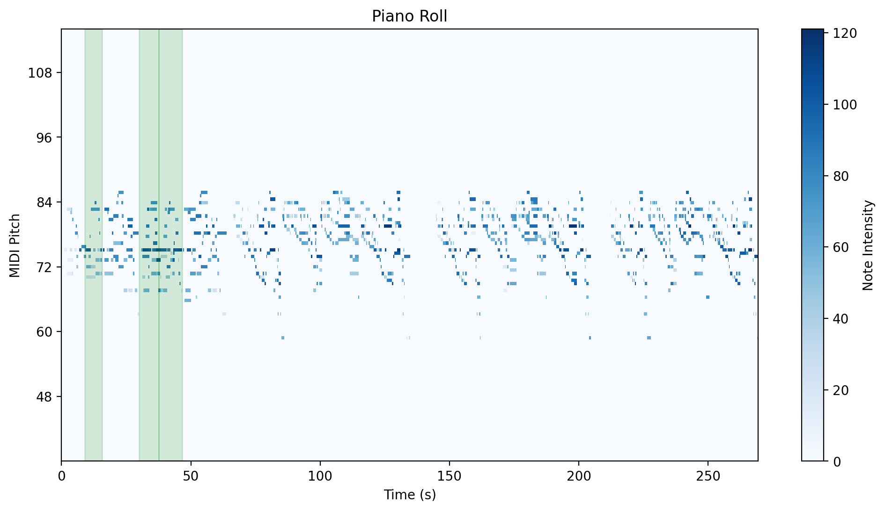
      </a>
       
      <em></em>
    </td>
    <td align="center" width="50%">
      <a href="">
        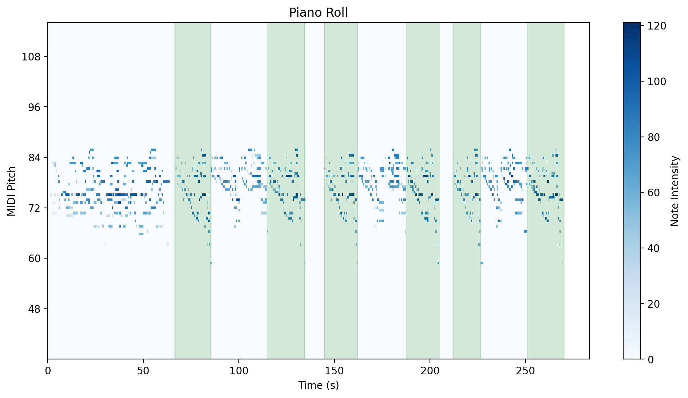
      </a>
       
      <em></em>
    </td>
  </tr>
  <tr>
    <td align="center" width="50%">
      <a href="">
        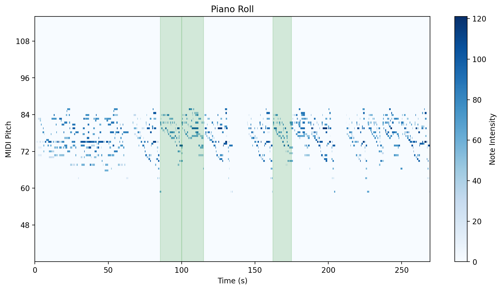
      </a>
       
      <em></em>
    </td>
    <td align="center" width="50%">
      <a href="">
        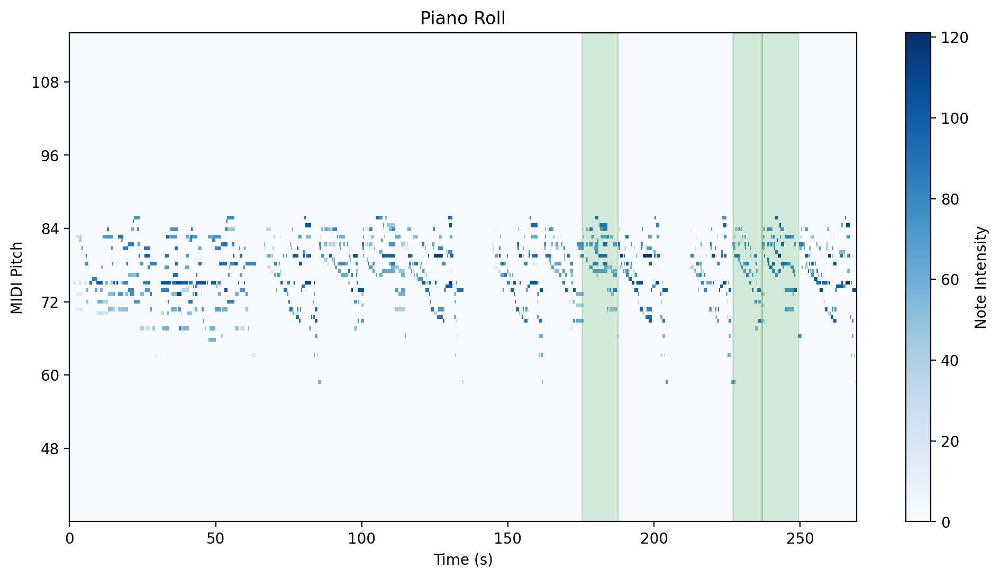
      </a>
       
      <em></em>
    </td>
  
</table>

### Challenges per group
- Group 1: The intervals are around 7 bins long,
  - so its first interval pair would be undetected, despite occuring as a diagonal without interruptions, it would only be detected with a lower minimum_length value.
  - Its second interval pair would also not result in a diagonal due to the latter interval being a variation with a different left hand.

- Group 2: intervals are variants, and usually one of the variants will include extra bins, resulting in the broken diagonal in the Similarity Matrix between the intervals.

- Group 3: challenges are similar to group 2

- Group 4: The intervals are longer and they are not variants; the differences between them are due to rehearsal elements.

- Groups 5 and 6 have similar traits as group 4. 

### Similarity Matrixes of intra-group fragment pairs
The tick indexes reflect the bin numbers within the SSM of the whole rehearsal. 

<table>
  <tr>
    <td align="center" width="50%">
      <a href="./figures/ponce_can/ponce20can_group2_intcomb1.png">
        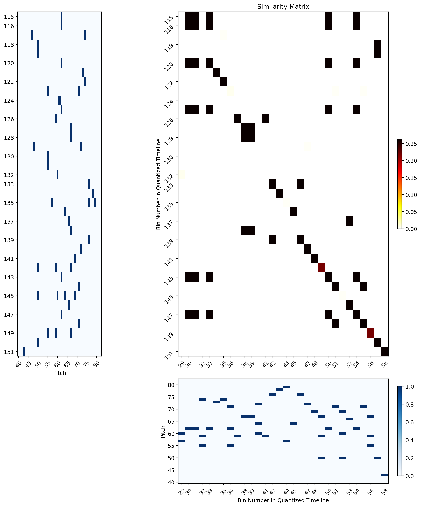
      </a>
       
      <em>Group 2 Example showing diagonal shifting due to compositional variations</em>
    </td>
    <td align="center" width="50%">
      <a href="./figures/ponce_can/ponce20can_group4_intcomb2.png">
        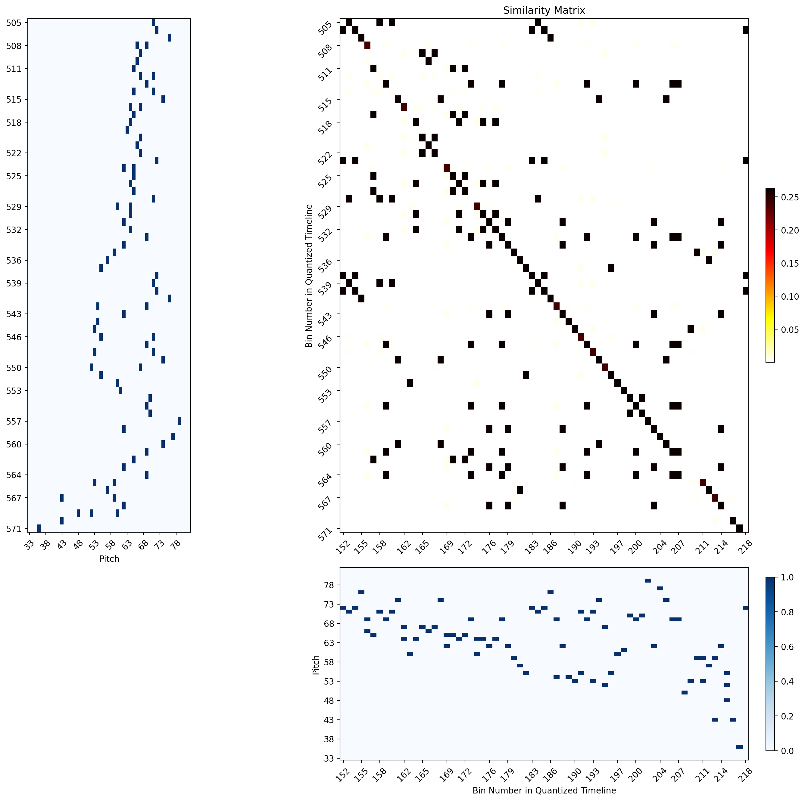
      </a>
       
      <em>Group 4 Example showing relatively long diagonals with some gaps and a shift towards the end</em>
    </td>
  </tr>
    <tr>
    <td align="center" width="50%">
      <a href="./figures/ponce_can/ponce20can_group5_intcomb2.png">
        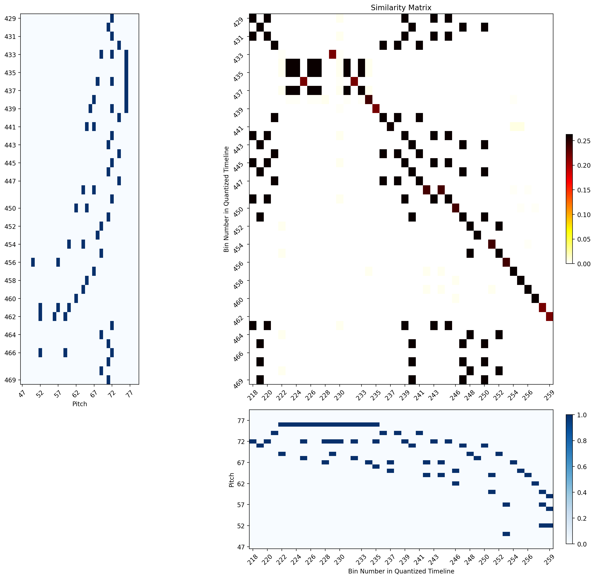
      </a>
       
      <em> Group 5 example</em>
    </td>
    <td align="center" width="50%">
      <a href="">
        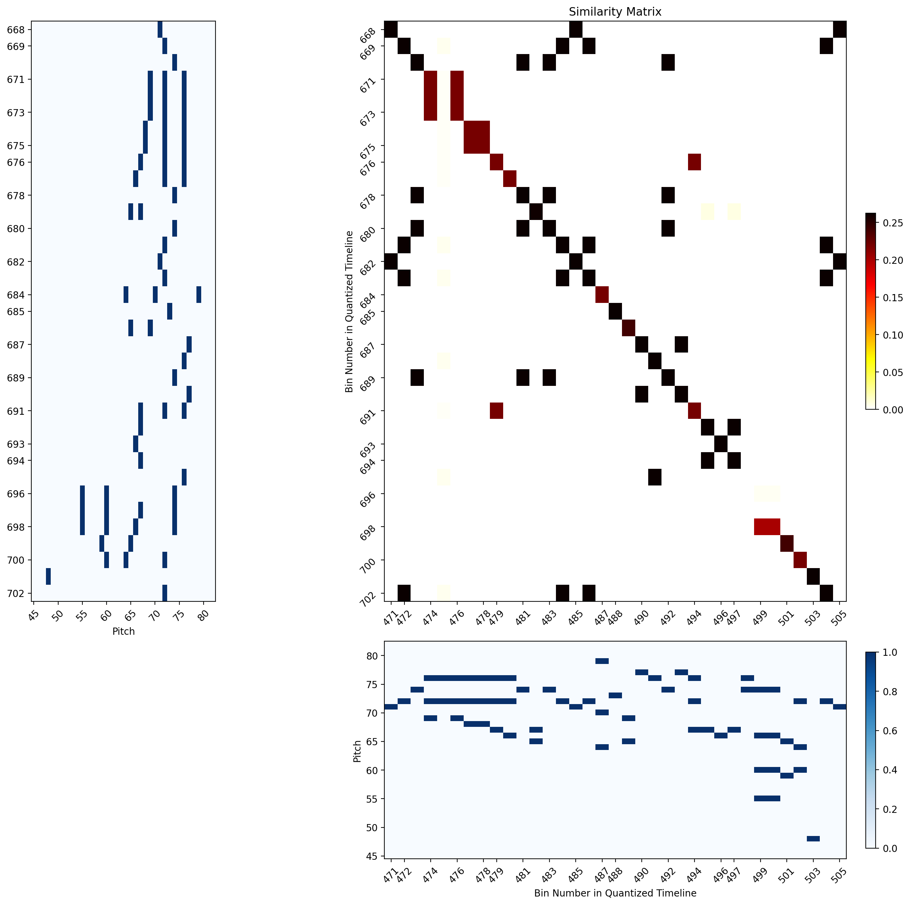
      </a>
       
      <em>Group6 Example</em>
    </td>
  </tr>
</table>

#### Diagonal Finding:

For the diagonal finding approach to pick all necessary diagonals for further grouping and filtering, there needs to be a balance between the following tradeoffs:

- Groups 1, 2, and 3 need shorter min_length settings
- Groups 4, 5, and 6 could rely on longer minimum length settings, although shorter settings could also help in identifying the smaller shifted diagonals for later grouping.

The light blue lines indicate the diagonals found using:
- minimum length = 10
- gap tolerance = 10
- similarity threshold = 0.2

<table>
  <tr>
    <td align="center" width="70%">
      <a href="./figures/ponce_can/ponce20can_diagonallengthdistro_10_0-2_10.png">
        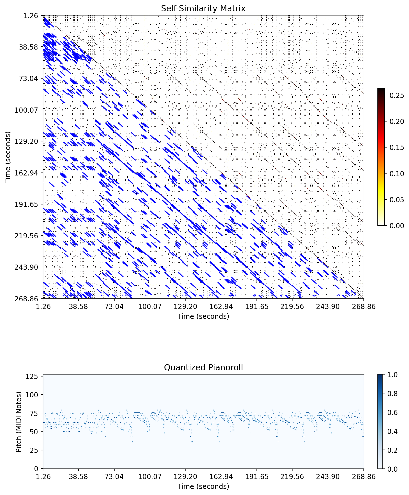
      </a>
       
      <em></em>
    </td>
  </tr>
</table>

This yields a very high number of short diagonals, far surpassing the number of fragments and groups in our annotations. We see an exaggerated number of diagonals is found at the minimum length setting.

<table>
  <tr>
    <td align="center" width="70%">
      <a href="./figures/ponce_can/ponce20can_diagonallengthdistro_10_0-2_10.png">
        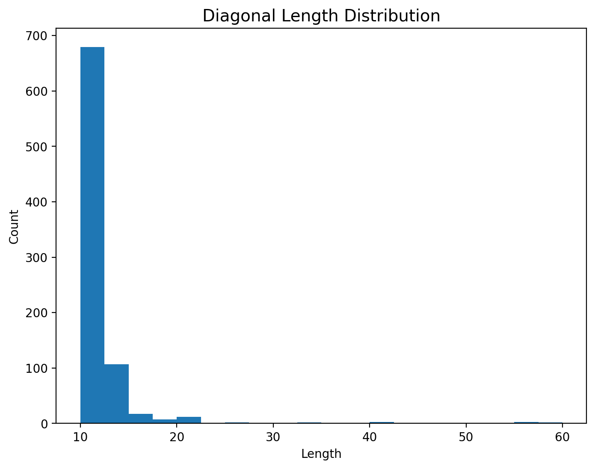
      </a>
       
      <em></em>
    </td>
  </tr>
</table>

<table>
  <tr>
    <td align="center" width="50%">
      
       
      <em></em>
    </td>
    <td align="center" width="50%">
      
       
      <em></em>
    </td>
  </tr>
    <tr>
    <td align="center" width="50%">
      
       
      <em> </em>
    </td>
    <td align="center" width="50%">
      
       
      <em></em>
    </td>
  </tr>
</table>

### Interval Results

Given the diagonal breaks that would be commonly expected in this type of data (demonstrated in the group 5 and 6 similarity matrix example), relevant intervals can appear as several shorter diagonals with minor offsets.  So, discarding all short diagonals without further examination would compromise the overall recall despite the noise they add to the results. This is individually these short diagonals do not meet the minimum length requirement. However, he combination of these diagonals with others in the same region could certainly be relevant to find longer contiguous related intervals. This is left for future work. 

<table>
  <tr>
    <td align="center" width="50%">
      
       
      <em>Results with low min length settings: (insert settings and download link)
</em>
    </td>
    <td align="center" width="50%">
      
       
      <em>Merged Groups Diagonal Length distribution</em>
    </td>
  </tr>
    <tr>
    <td align="center" width="50%">
      
       
      <em> Results with low min length settings: (insert settings and download link)</em>
    </td>
    <td align="center" width="50%">
      
       
      <em>Merged Groups Diagonal Length distributio</em>
    </td>
  </tr>
</table>

- interval_overlap_ratio = 0.85

