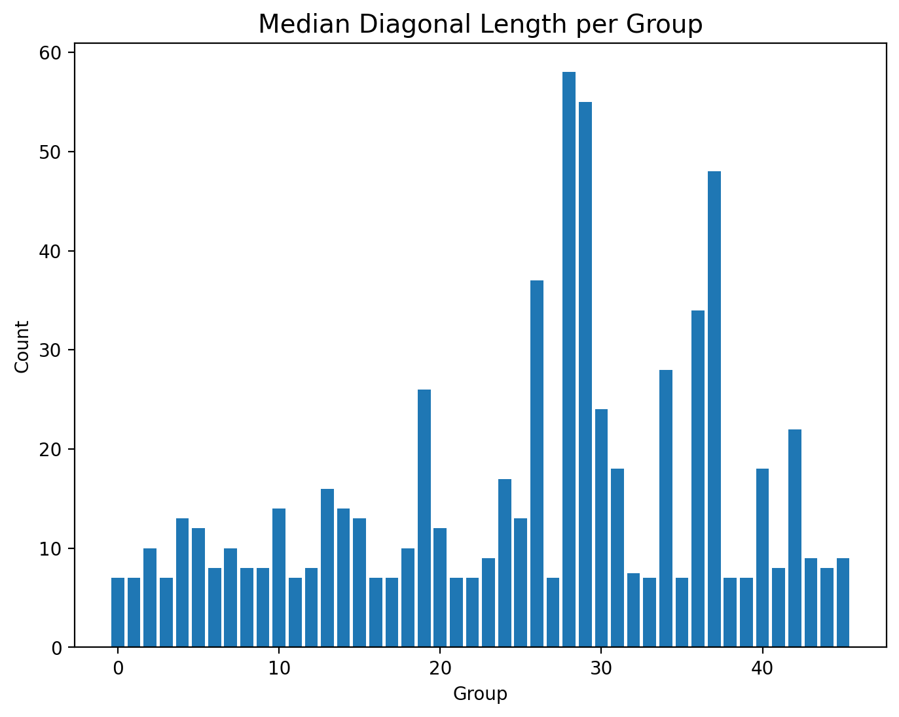
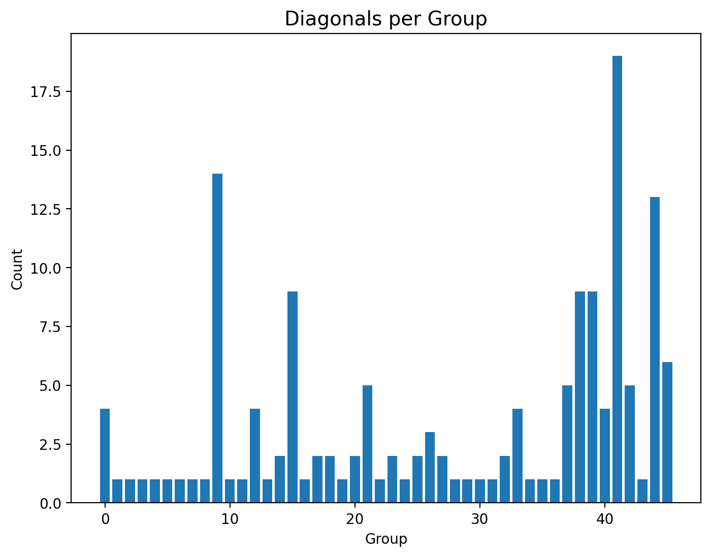
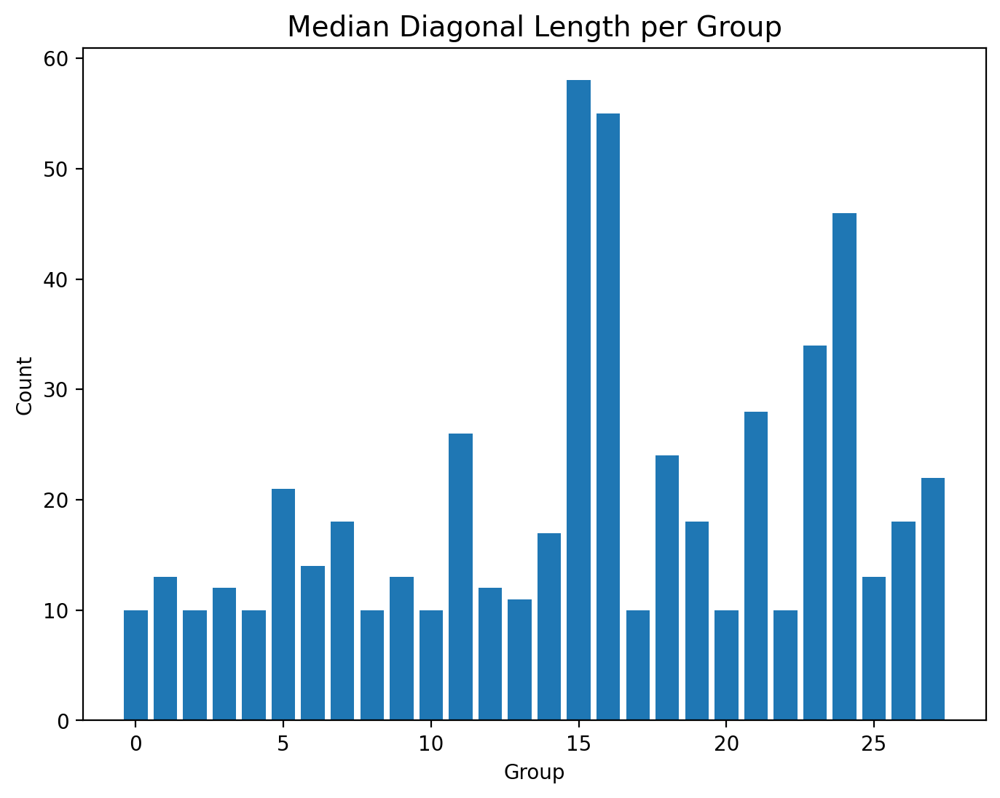
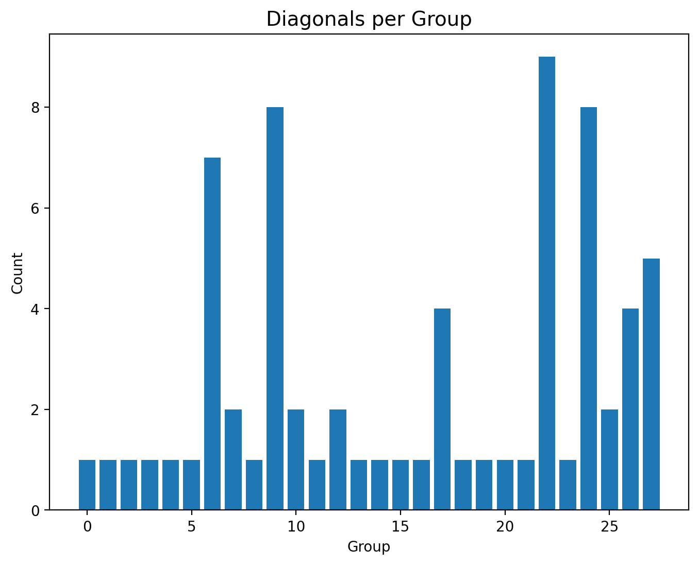

### Annotation File 2
- **Filename**: 2024-08-27_18-16_03_ponce_20Can-part2_annot.mid
- **Download**: [MIDI](./annotated_files/2024-08-27_18-16_03_ponce_20Can/2024-08-27_18-16_03_ponce_20Can-part2_annot.mid)
- **Groups**: 6
- **Description**: A longer example of an intermediate level repertoire with some overlaps between groups (specifically, some groups are subsets of others). There are several note mistakes and note repetitions. The most challenging aspect are compositional variations between intervals of the same group, where the rh is the same but the lh is different. Furthermore, some groups have 2 related intervals only. 

#### Visual Overview

<table>
  <tr>
    <td align="center" width="50%">
      
       
      <em></em>
    </td>
    <td align="center" width="50%">
      
       
      <em></em>
    </td>
  </tr>
  <tr>
    <td align="center" width="50%">
      
       
      <em></em>
    </td>
    <td align="center" width="50%">
      
       
      <em></em>
    </td>
  </tr>
  <tr>
    <td align="center" width="50%">
      
       
      <em></em>
    </td>
    <td align="center" width="50%">
      
       
      <em></em>
    </td>
  
</table>

#### Challenges per group
- Group 1: The intervals are around 7 bins long,
  - so despite occuring as a diagonal without interruptions, the group's first interval pair would be undetected unless the minimum_length value is set to be very low.
  - Its second interval pair would also not result in a diagonal due to the latter interval being a variation with a different left hand.

- Group 2: this group relates intervals that are based on variants. When this happens, then even in the case of no extra or missing notes, the intervals belonging to a variant will include a different number of bins than those of the other.

- Group 3: challenges are similar to group 2

- Groups 4, 5, and 6: The intervals are longer and they are not variants; the differences between them are due to rehearsal elements.

A closer look at the similarity matrixes between intervals of a group can demonstrate the above traits.

<table>
  <tr>
    <td align="center" width="50%">
      
       
      <em>Group 2 Example showing diagonal shifting due to compositional variations</em>
    </td>
    <td align="center" width="50%">
      
       
      <em>Group 4 Example showing relatively long diagonals with some gaps and a shift towards the end</em>
    </td>
  </tr>
    <tr>
    <td align="center" width="50%">
      
       
      <em> Group 5 example</em>
    </td>
    <td align="center" width="50%">
      
       
      <em>Group6 Example</em>
    </td>
  </tr>
</table>

*The tick indices reflect the bin numbers within the SSM of the whole rehearsal.*

### Walkthrough of the Rehearsal Structure Analysis Pipeline

#### Diagonal Finding:

The diagonals found at this phase are the only information passed from the SSM onto the subsequent pipeline phases. For the diagonal finding approach to pick all necessary diagonals for further grouping and filtering, our initial hypothesis is that there needs to be a balance between the following tradeoffs:

- Groups 1, 2, and 3 need shorter min_length settings
- Groups 4, 5, and 6 could rely on longer minimum length settings, although shorter settings could also help in identifying the smaller shifted diagonals for later grouping.

The light blue lines indicate the diagonals found using:
- minimum length = 10
- gap tolerance = 5 (gap tolerance must be less than min length)
- similarity threshold = 0.2

<table>
  <tr>
    <td align="center" width="70%">
      
       
      <em></em>
    </td>
  </tr>
</table>

<table>
  <tr>
    <td align="center" width="70%">
      
       
      <em></em>
    </td>
  </tr>
</table>

One way to understand the effectiveness of these settings is to see how the diagonals relate to the retrieval of group information. Below are the self similarity matrixes overlayed with interval information and the retrieved set of diagonals above. The intersection between the green horizontal and vertical rectangles represents the similarity matrix between 2 intervals of that group (for example, one of such intersections would a similarity matrix as shown for the intra-group fragment pairs above)

<table>
  <tr>
    <td align="center" width="50%">
      
       
      <em>Group 1</em>
    </td>
    <td align="center" width="50%">
      
       
      <em> Group 2</em>
    </td>
  </tr>
    <tr>
    <td align="center" width="50%">
      
       
      <em> Group 3</em>
    </td>
    <td align="center" width="50%">
      
       
      <em> Group 4</em>
    </td>
  </tr>
  <tr>
    <td align="center" width="50%">
      
       
      <em>Group 5</em>
    </td>
    <td align="center" width="50%">
      
       
      <em> Group 6</em>
    </td>
</table>

From the plots above we can see the following:
- As initially thought, this search does not yield enough diagonals in the intersecting boxes of the first 3 groups.
- For the last 3 groups it would be possible to postprocess this search meaningfully, although the recall is also not perfect. 

In contrast, we use different settings and observe their effect:

- minimum length = 7
- gap tolerance = 4 (gap tolerance must be less than min length)
- similarity threshold = 0.15

<table>
  <tr>
    <td align="center" width="70%">
      
       
      <em></em>
    </td>
  </tr>
</table>

<table>
  <tr>
    <td align="center" width="70%">
      
       
      <em></em>
    </td>
  </tr>
</table>

This is the observed effect on the groups

<table>
  <tr>
    <td align="center" width="50%">
      
       
      <em>Group 1</em>
    </td>
    <td align="center" width="50%">
      
       
      <em> Group 2</em>
    </td>
  </tr>
    <tr>
    <td align="center" width="50%">
      
       
      <em> Group 3</em>
    </td>
    <td align="center" width="50%">
      
       
      <em> Group 4</em>
    </td>
  </tr>
  <tr>
    <td align="center" width="50%">
      
       
      <em>Group 5</em>
    </td>
    <td align="center" width="50%">
      
       
      <em> Group 6</em>
    </td>

</table>

There are several things to note:

- These settings mean that we want to retrieve diagonals of length 7 permitting up to 4 mismatches. This is too permissive to apply for certain types of compositions which would involve periodically repeating bins.

- Furthermore, despite being permissive settings, they still do not perfectly retrieve peaks in the intersections of groups 1, 2 and 3. However, this is likely the effect of grouping intervals that are variations of one another, where even in the case of perfect matches there would be variations between bins (let alone mistakes or repetitions).

- However, the short diagonals from these settings would allow some information pertaining to the first 3 groups to be passed to the next pipeline phases. 

#### Grouping and Merging (and Resulting Intervals)
As shown in the technical appendix, the found diagonals are grouped based on horizontal and vertical overlaps, followed by a final merging phase is simply to merge the horizontal and vertical groups based on overlapping diagonals. 

When the number of resultant groups is small, 

<table>
  <tr>
    <td align="center" width="20%">
      
       
      <em>params</em>
    </td>
    <td align="center" width="30%">
      
       
      <em>Median Diag. Length/Group</em>
    </td>
    <td align="center" width="30%">
      
       
      <em>Diag. Count per Group</em>
    </td>
    <td align="center" width="20%">
      
       
      <em>Inverval Results</em>
    </td>
  </tr>
    <tr>
    <td align="center" width="20%">
      
       
      <em> minimum length: 7,
          similarity threshold: 0.15,
          gap tolerance: 4, 
          interval overlap ratio: 0.8
          </em>
    </td>
    <td align="center" width="30%">
      
       
      <em></em>
    </td>
    <td align="center" width="30%">
      
       
      <em> </em>
    </td>
    <td align="center" width="20%">
        <a href="./annotated_files/2024-08-27_18-16_03_ponce_20Can/results/7_0-15_4_0.8.zip">
        <em>Results</em>
      </a>
             <em></em>
    </td>
  </tr>
  <tr>
    <td align="center" width="20%">
      
       
      <em>minimum length: 10, similarity threshold: 0.2, 
      gap tolerance: 4, 
      interval overlap ratio: 0.8 </em>
    </td>
    <td align="center" width="30%">
      
       
      <em></em>
    </td>
    <td align="center" width="30%">
      
       
      <em> </em>
    </td>
    <td align="center" width="20%">
      <a href="./annotated_files/2024-08-27_18-16_03_ponce_20Can/results/10_0-2_5_0.8.zip">
        <em>Results</em>
      </a>
       
      <em></em>
    </td>
  </tr>
  <tr>
    <td align="center" width="20%">
      
       
      <em></em>
    </td>
    <td align="center" width="30%">
      
       
      <em></em>
    </td>
    <td align="center" width="30%">
      
       
      <em> </em>
    </td>
    <td align="center" width="20%">
      
       
      <em> </em>
    </td>
  </tr>
</table>

- How can we use this group information to check the results.
- Which results set performs better on which group. 

### Conclusions:
- The investigation of the pipeline steps on the annotated files has revealed several points of failure that can be addressed for future iterations.

- Although (naturally) longer minimum length settings give better precision and lower recall, using high minimum length cutoffs discards useful information relating to short diagonals. Such short diagonals can be merged with other shorter diagonals or longer ones which within short bin windows before and after, to successfuly identify related intervals of varying lengths and with rehearsal type hesitations.

- Furthermore, the intervals have merged some of the  'broken diagonals' demonstrated in the similarity matrixes of individual intervals and in the diagonal finding results was retrieved

- Warping between the intervals of a group based on bin similarity is a classical solution to the 'broken diagonals' observation. While it could be used in future iterations, we were mostly interested computationally cheaper approaches to retrieve information from the whole rehearsal. 

- Additional post-processing by filtering the resulting groups could be useful especially when shorter minimum length settings are chosen.

- Another suggestion is to separate between the minimum search length and the minimum length of a returned interval. This would balance between the inclusion of all necessary information during the grouping and merging phases, and the elimination of unnecessary intervals at the final step.

- Finally, a larger annotated set (from the < Anonymized > MIDI dataset) with more rehearsal specific challenges would be needed to validate and evaluate the system.

