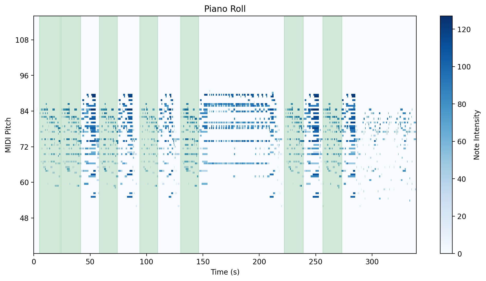
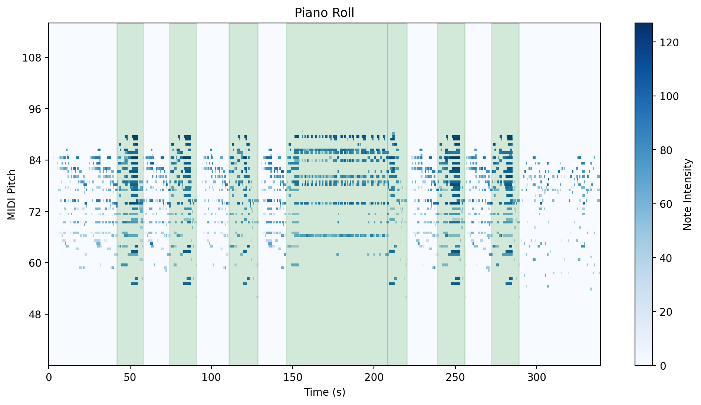
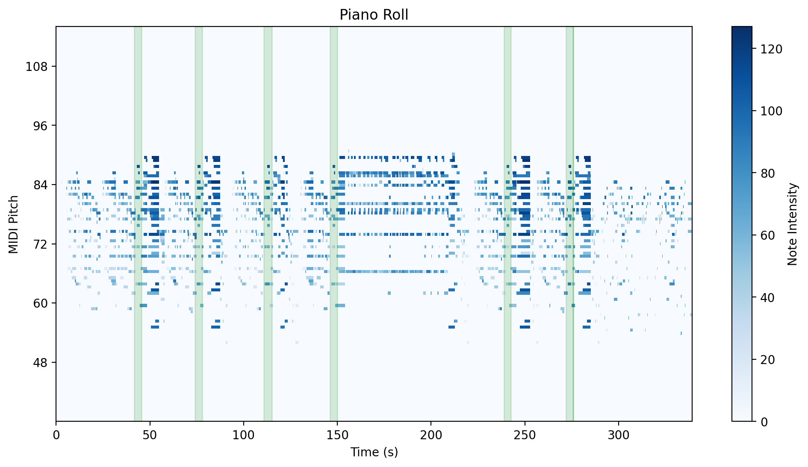
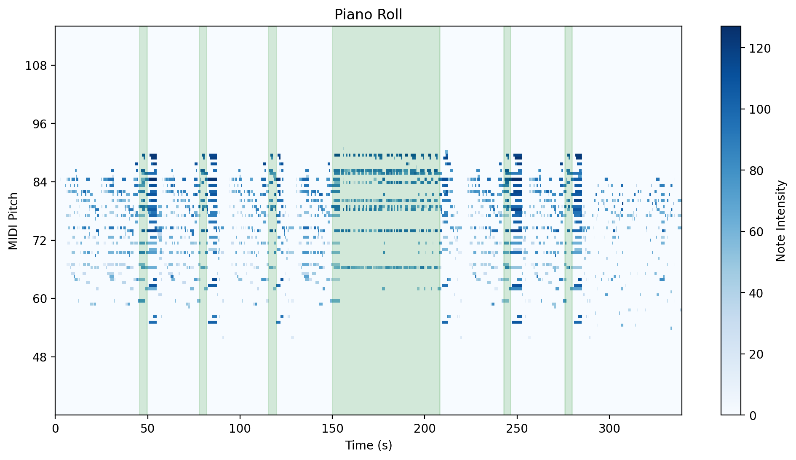
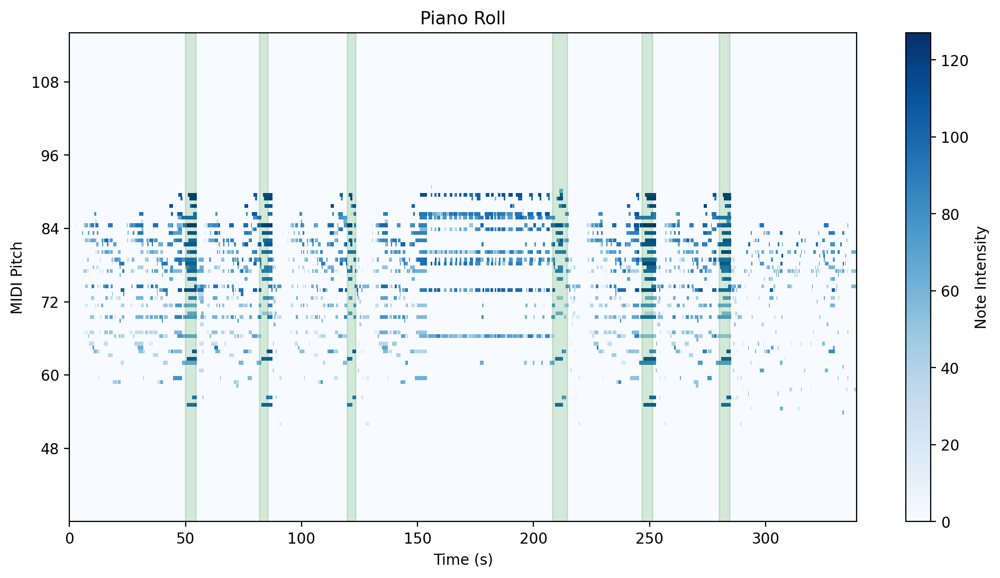
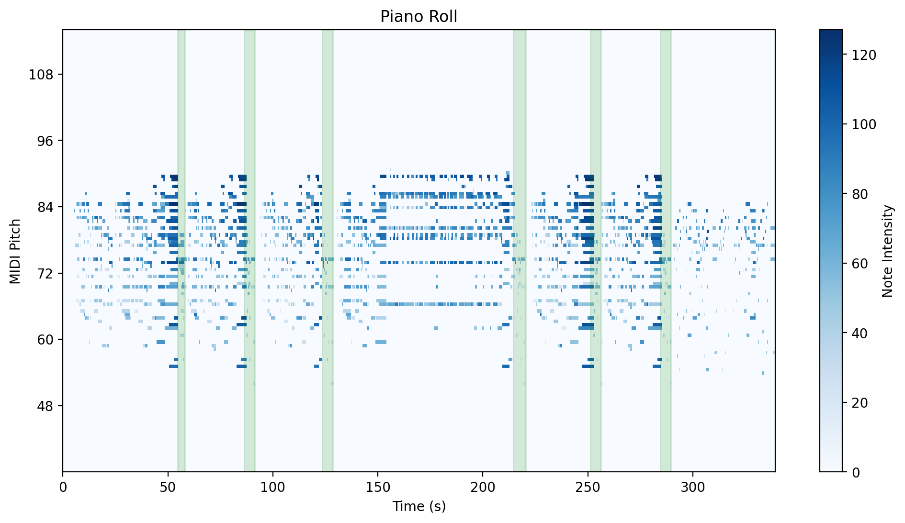
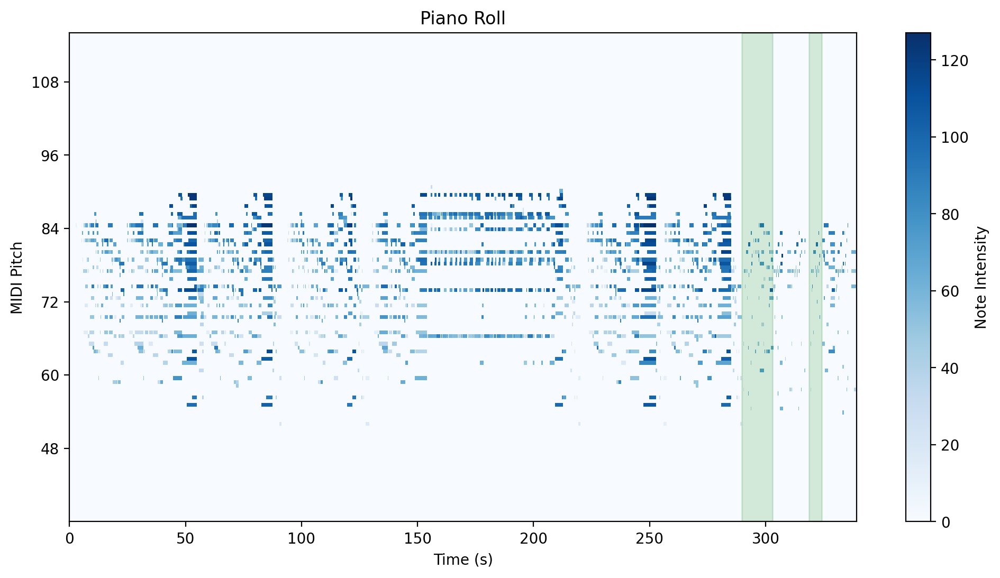
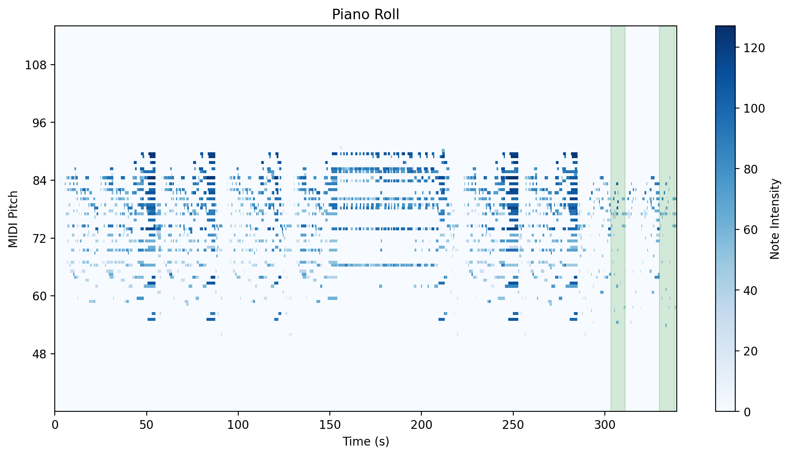

### Annotation File 3
- **Filename**: 2024-08-28_08-11_04_ponce_gav_part1_annot.mid
- **Download**: [MIDI](./annotated_files/2024-08-28_08-11_04_ponce_gav/2024-08-28_08-11_04_ponce_gav_part1_annot.mid)
- **Groups**: 8
- **Description**: A longer example of an intermediate-advanced level repertoire with overlaps between groups. The texture of the composition is prone to cause note order errors and mistouches.
   - Unlike the other annotation examples, all grouped intervals are strictly based on the same musical fragment (no grouping of variations)
   - A notable feature is the presence of a long interval with a large number of short repetitions in a loop-like manner(around 8-10 bins each), as the player is practicing their technique (this interval can be seen in groups and 4).
   - Group 2 is the superset of groups 3, 4, 5, and 6. We do that in this example to specifically understand the effect of the aforementioned repetition loop on grouping the superset (group 2) and the subset (group 4) in question. 
   - Otherwise, there are several note mistakes and note repetitions (within windows of 1-5 notes until recovery from the mistake).
  

### Visual Overview

<table>
  <tr>
    <td align="center" width="50%">
      
       
      <em>Annotation Example 1</em>
    </td>
    <td align="center" width="50%">
      
       
      <em>Annotation Example 2</em>
    </td>
  </tr>
  <tr>
    <td align="center">
      
       
      <em>Annotation Example 3</em>
    </td>
    <td align="center">
      
       
      <em>Annotation Example 4</em>
  </tr>
    <tr>
    <td align="center" width="50%">
      
       
      <em>Annotation Example 5</em>
    </td>
    <td align="center" width="50%">
      
       
      <em>Annotation Example 6</em>
    </td>
  </tr>
  <tr>
    <td align="center">
      
       
      <em>Annotation Example 7</em>
    </td>
    <td align="center">
      
       
      <em>Annotation Example 8</em>
  </tr>
</table>