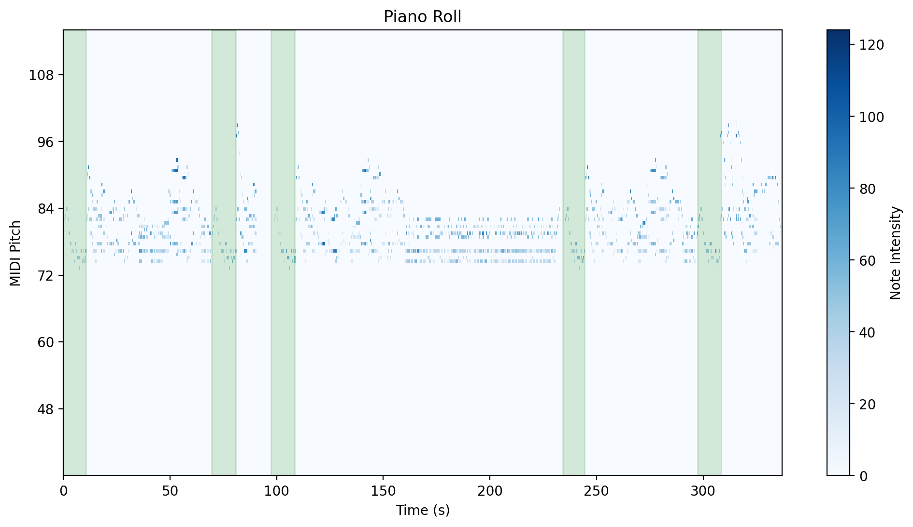
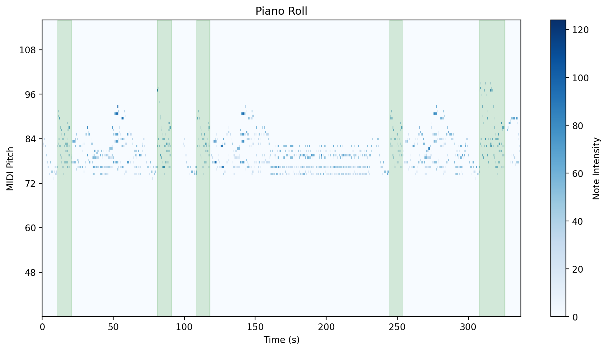
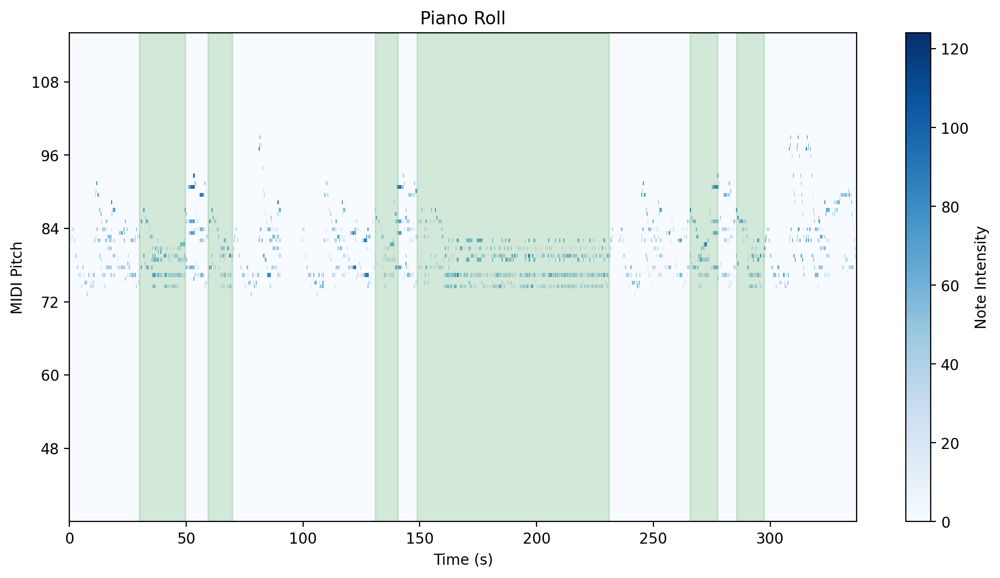
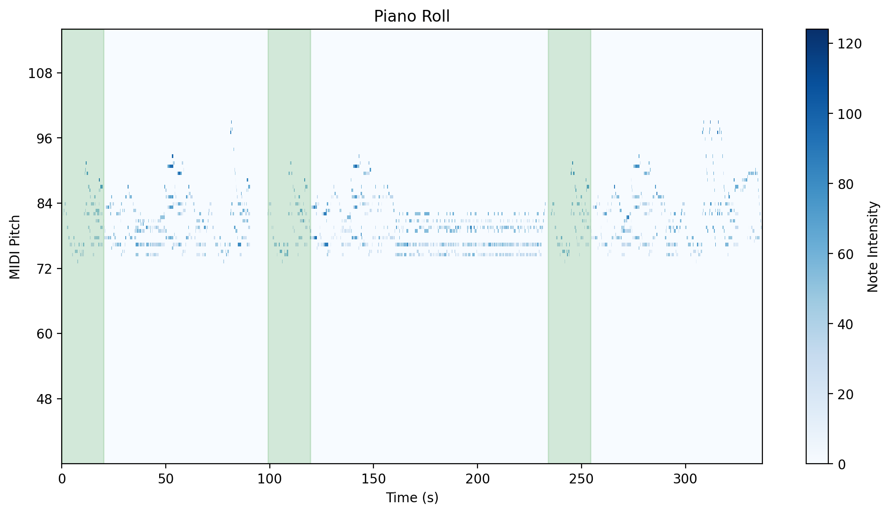

### Annotation File 4
- **Filename**: warmup_2021-09-20_a01_constructed_annot.mid
- **Download**: [MIDI](./annotated_files/warmup_2021-09-20_a01/warmup_2021-09-20_a01_constructed_annot.mid)
- **Groups**: 5
- **Description**:
   - More instances of the same group compared to the other annotation files.
   - No grouping of variations (similar to Annotation File 3).

### Visual Overview

<table>
  <tr>
    <td align="center" width="50%">
      
       
      <em>Group 1</em>
    </td>
    <td align="center" width="50%">
      
       
      <em>Group 2</em>
    </td>
  </tr>
  <tr>
    <td align="center">
      
       
      <em>Group 3</em>
    </td>
    <td align="center">
      
       
      <em>Group 4</em>
  </tr>
    <tr>
    <td align="center" width="50%">
      
       
      <em>Group 5</em>
    </td>
    <td align="center" width="50%">
      
       
      <em></em>
    </td>
  </tr>
</table>